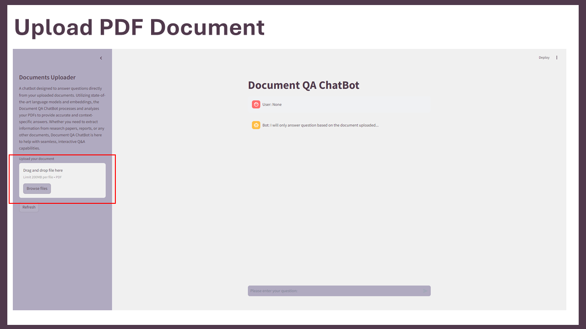
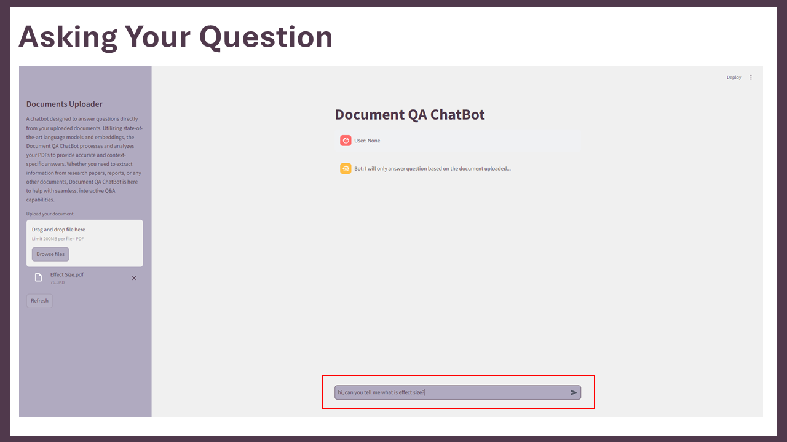
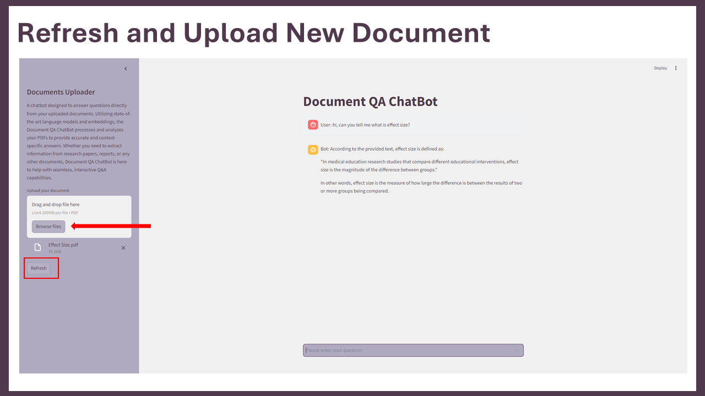

## Document QA ChatBot

A chatbot designed to answer questions directly from your uploaded documents. 
Utilizing state-of-the-art language models and embeddings, the Document QA ChatBot processes and analyzes your PDFs to provide accurate and context-specific answers. 
Whether you need to extract information from research papers, reports, or any other documents, Document QA ChatBot is here to help with seamless, interactive Q&A capabilities.

Upload your pdf document.

Start the QA chat.

Refresh and upload a new pdf document and initiate a new QA chat.

⏩ <a href="https://shihjen-document-qa-chatbot-app-sykc0q.streamlit.app/">Web Application</a>
